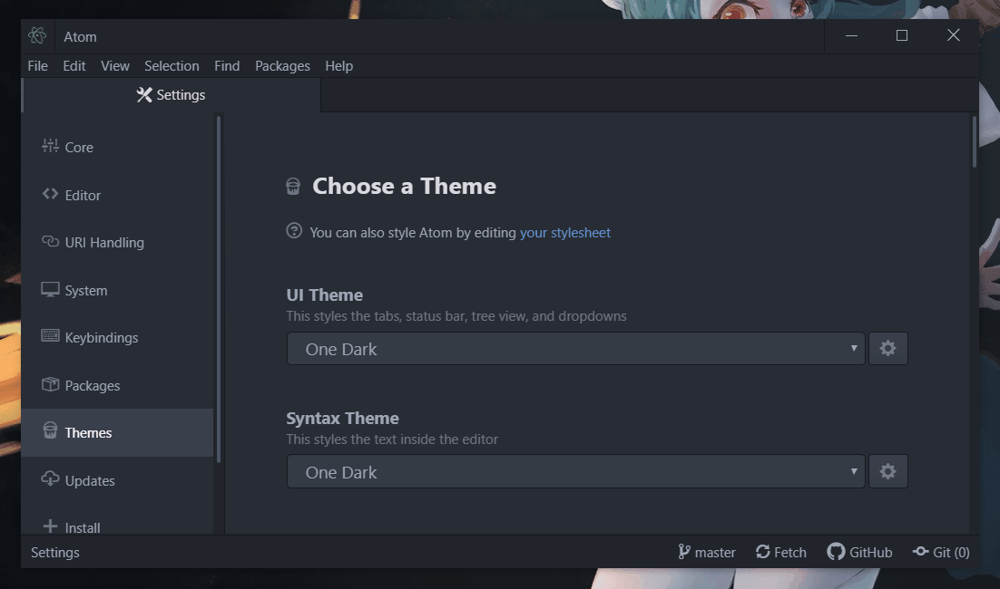
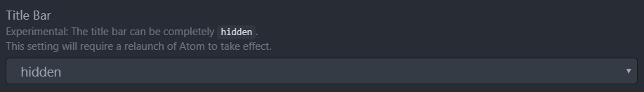

# Atom Windows Titlebar
The title bar replacement for Atom on Windows 10

## Matches title bar and menu with atoms theme

## ⚠ Don't forget to hide default title bar in Atom's settings

1. In settings -> Core -> set titlebar to hidden
2. Restart atom!
